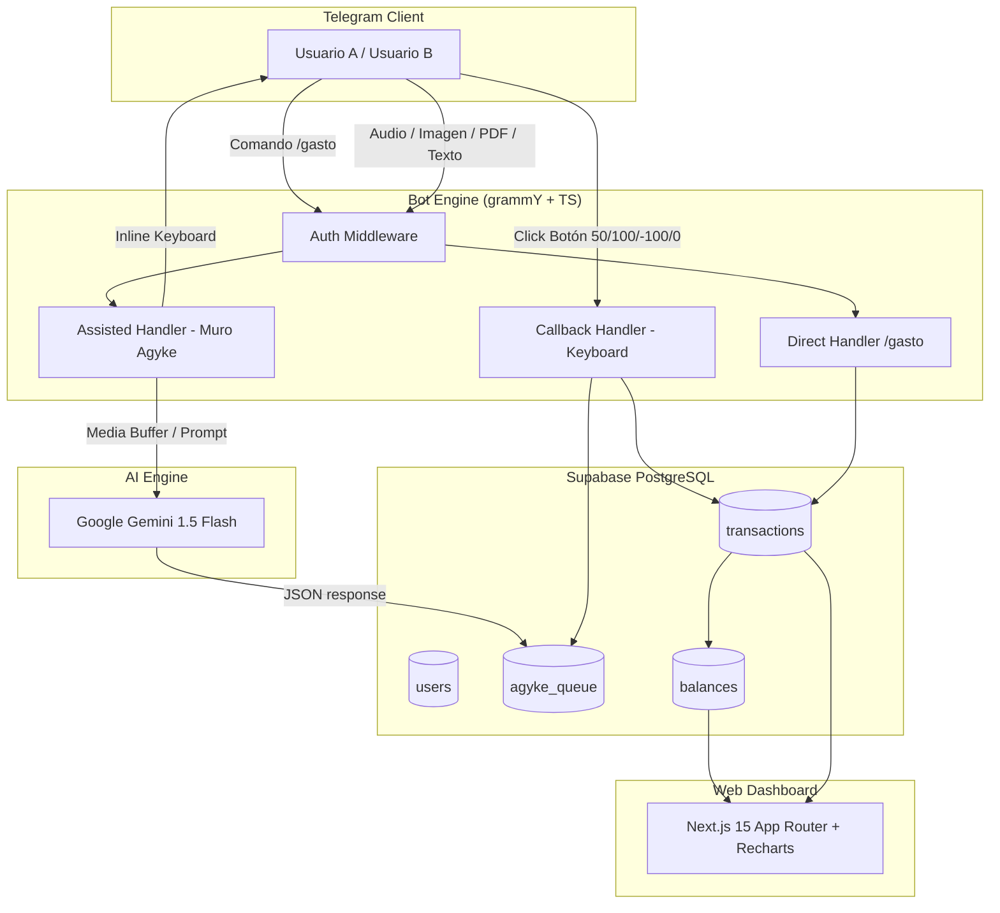

<div align="center">

# AGYKE

**Sistema Inteligente de Control de Gastos Compartidos**  
*Bot de Telegram impulsado por Gemini 1.5 Flash + Dashboard Web en Next.js 15*

[](https://nodejs.org/)
[](https://www.typescriptlang.org/)
[](https://deepmind.google/technologies/gemini/)
[](https://grammy.dev/)
[-000000?style=for-the-badge&logo=nextdotjs&logoColor=white)](https://nextjs.org/)
[](https://supabase.com/)

</div>

---

## Visión General

**Agyke** es una plataforma integral diseñada para simplificar la gestión de gastos compartidos entre dos usuarios (ej. compañeros de departamento o parejas). Combina la inmediatez de un **Bot de Telegram** potenciado con Inteligencia Artificial Multimodal (**Gemini 1.5 Flash**) y la claridad visual de un **Dashboard Web en Next.js 15** con estética oscura y *glassmorphism*.

> [!TIP]
> ¡Olvídate de ingresar datos manualmente! Solo reenvía un comprobante en PDF, envía una foto de un ticket, o graba una nota de voz en Telegram. Gemini extraerá el monto y concepto automáticamente.

---

## Características Principales

### 1. Flujo Directo de Registro
Para gastos rápidos sin pasar por la cola de revisión:
- **Comando:** `/gasto <monto> <concepto> <clasificacion>`
- **Ejemplo:** `/gasto 15000 Coto 50`
- Impacta instantáneamente en la base de datos y recalcula el saldo consolidado (`net_balance`).

### 2. Muro Agyke (Pipeline Asistido con IA)
Para entradas multimodales o ambiguas:
- **Entradas Soportadas:**
  - **Notas de Voz** (`.ogg`, `.mp3`, `.m4a`): Transcripción y extracción contable.
  - **Comprobantes / Tickets** (`.pdf`, `.jpg`, `.png`): Lectura OCR inteligente.
  - **Texto Libre** (ej. `12500 Verdulería`): Parsing automático de concepto y monto.
- **Interacción en Telegram:** Genera un mensaje interactivo con un *Inline Keyboard* de 4 botones para clasificar la deuda con un solo toque.

### 3. Lógica Financiera Sin Adivinaciones
Cálculo estricto y consolidado en la tabla `balances`:
- **`net_balance > 0`**: El Usuario B le debe dinero al Usuario A.
- **`net_balance < 0`**: El Usuario A le debe dinero al Usuario B.
- **`net_balance == 0`**: Cuentas completamente saldadas.

#### Matriz de Impacto de Deuda

| Botón Inline | Clasificación | Fórmula de Impacto (`debt_impact`) | Descripción |
| :---: | :--- | :--- | :--- |
| **`50`** | Compartido 50/50 | `+ (Monto / 2)` para el pagador | Gasto dividido en partes iguales. |
| **`100`** | Favor 100% | `+ Monto` para el pagador | El pagador cubrió la totalidad por el otro usuario. |
| **`-100`** | Deuda Propia | `- Monto` para el pagador | El pagador asume la totalidad de la deuda. |
| **`0`** | Personal | `$0` de impacto en balance | Gasto individual, no modifica saldos compartidos. |

---

### 4. Dashboard Web Moderno (Next.js 15)
- **Interfaz Glassmorphic Ultra-Premium:** Estética oscura, degradados sutiles y micro-animaciones.
- **Métricas en Tiempo Real:** Tarjetas con el estado de deuda neta, total gastado y desglose por usuario.
- **Visualización de Datos:** Gráficos interactivos construidos con Recharts.
- **Historial Completo:** Tabla responsiva de transacciones con filtrado en tiempo real por búsqueda de texto y clasificación.

---

## Arquitectura del Sistema



---

## Estructura del Proyecto

```
agyke/
├── docs/                      # Especificaciones del proyecto
│   ├── ARCHITECTURE.md        # DDL de PostgreSQL, tipos e integración Gemini
│   ├── REQUIREMENTS.md        # Requerimientos funcionales y lógica contable
│   └── TASKS.md               # Roadmap y estado de implementación
├── src/                       # Backend & Bot Engine (TypeScript)
│   ├── bot/
│   │   ├── commands/          # Handlers de comandos (/gasto)
│   │   ├── handlers/          # Listener del Muro Agyke y callbacks de botones
│   │   ├── middlewares/       # Middleware de autenticación y auto-registro
│   │   └── index.ts           # Punto de entrada principal del bot
│   ├── lib/                   # Clientes (Supabase Client)
│   ├── services/              # Servicio de Recálculo de Balance y Gemini AI
│   └── types/                 # Interfaces TypeScript estrictas
├── supabase/                  # Scripts SQL y migraciones
│   └── schema.sql             # Script DDL de base de datos
├── web/                       # Dashboard Frontend (Next.js 15 + Tailwind CSS)
│   ├── app/                   # App Router (Páginas, Layout, APIs)
│   ├── components/            # Componentes UI glassmorphic y gráficos
│   └── package.json
├── .env.example               # Plantilla de variables de entorno
├── package.json               # Scripts y dependencias backend
└── tsconfig.json              # Configuración TypeScript estricto
```

---

## Guía de Instalación y Configuración

### 1. Requisitos Previos
- **Node.js**: `v20.0.0` o superior.
- **npm** o **pnpm**.
- Una cuenta en **Supabase** (Proyecto PostgreSQL activo).
- Un Token de **Telegram Bot** (obtenido mediante [@BotFather](https://t.me/BotFather)).
- Una API Key de **Google Gemini AI** (obtenida en [Google AI Studio](https://aistudio.google.com/)).

---

### 2. Clonar e Instalar Dependencias

```bash
# Clonar el repositorio
git clone https://github.com/n1krov/agyke.git
cd agyke

# Instalar dependencias del Bot (Backend)
npm install

# Instalar dependencias del Dashboard (Frontend)
cd web && npm install && cd ..
```

---

### 3. Configuración de Variables de Entorno

Crea un archivo `.env` en la raíz del proyecto basándote en `.env.example`:

```env
TELEGRAM_BOT_TOKEN="123456789:AAA..."
GEMINI_API_KEY="AIzaSy..."
SUPABASE_URL="https://your-project.supabase.co"
SUPABASE_SERVICE_ROLE_KEY="ey..."
```

---

### 4. Configurar la Base de Datos (Supabase)

Ejecuta el script SQL ubicado en [`supabase/schema.sql`](file:///home/n1krov/projects/agyke/supabase/schema.sql) (o en [`docs/ARCHITECTURE.md`](file:///home/n1krov/projects/agyke/docs/ARCHITECTURE.md)) dentro del **SQL Editor** de tu panel de Supabase.

<details>
<summary><b>Ver Script SQL DDL</b></summary>

```sql
CREATE EXTENSION IF NOT EXISTS "uuid-ossp";

-- Tabla de Usuarios
CREATE TABLE users (
    id UUID PRIMARY KEY DEFAULT uuid_generate_v4(),
    telegram_id BIGINT UNIQUE NOT NULL,
    name TEXT NOT NULL,
    created_at TIMESTAMP WITH TIME ZONE DEFAULT NOW()
);

-- Muro Agyke (Cola de Pendientes)
CREATE TABLE agyke_queue (
    id UUID PRIMARY KEY DEFAULT uuid_generate_v4(),
    user_id UUID NOT NULL REFERENCES users(id) ON DELETE CASCADE,
    amount NUMERIC(12, 2) NOT NULL,
    concept TEXT,
    file_path TEXT,
    source_type TEXT NOT NULL CHECK (source_type IN ('audio', 'image', 'text')),
    status TEXT DEFAULT 'PENDING' CHECK (status IN ('PENDING', 'PROCESSED', 'DISCARDED')),
    telegram_message_id BIGINT,
    created_at TIMESTAMP WITH TIME ZONE DEFAULT NOW()
);

-- Transacciones Procesadas
CREATE TABLE transactions (
    id UUID PRIMARY KEY DEFAULT uuid_generate_v4(),
    user_id UUID NOT NULL REFERENCES users(id) ON DELETE CASCADE,
    amount NUMERIC(12, 2) NOT NULL,
    concept TEXT,
    classification TEXT NOT NULL CHECK (classification IN ('50', '100', '-100', '0')),
    debt_impact NUMERIC(12, 2) NOT NULL,
    created_at TIMESTAMP WITH TIME ZONE DEFAULT NOW()
);

-- Balance Neto entre los dos usuarios
CREATE TABLE balances (
    id UUID PRIMARY KEY DEFAULT uuid_generate_v4(),
    user_a_id UUID NOT NULL REFERENCES users(id),
    user_b_id UUID NOT NULL REFERENCES users(id),
    net_balance NUMERIC(12, 2) DEFAULT 0.00,
    updated_at TIMESTAMP WITH TIME ZONE DEFAULT NOW(),
    CONSTRAINT unique_user_pair UNIQUE (user_a_id, user_b_id)
);
```

</details>

---

## Ejecución del Proyecto

### Modo Desarrollo

```bash
# Iniciar el Bot de Telegram
npm run dev:bot

# Iniciar el Dashboard Web (Next.js en http://localhost:3000)
npm run dev:web
```

### Compilado y Producción

```bash
# Compilar TypeScript del Bot y Next.js Web
npm run build && npm run build:web

# Iniciar el Bot en producción
npm run start
```

---

## Tecnologías Utilizadas

- **Core & Backend:** Node.js (v20+), TypeScript Strict Mode.
- **Bot Engine:** [grammY Framework](https://grammy.dev/) (Telegram Bot API).
- **AI Engine:** Google Generative AI SDK (`@google/generative-ai`) - Modelo `gemini-1.5-flash`.
- **Database:** Supabase Client (`@supabase/supabase-js`) & PostgreSQL.
- **Frontend Web:** Next.js 15+ (App Router), React 19, Tailwind CSS v4, Lucide Icons, Recharts.

---

## Licencia

Este proyecto fue desarrollado bajo la especificación del sistema Agyke. MIT License.
