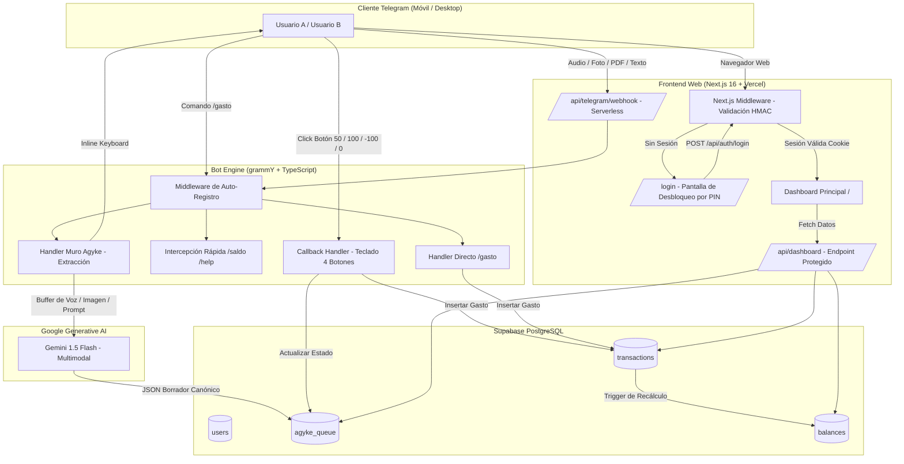

<div align="center">

# AGYKE

**Sistema Inteligente y Autónomo de Control de Gastos Compartidos**  
*Bot de Telegram Asistido por Gemini 1.5 Flash + Dashboard Web en Next.js 16 con Autenticación por PIN*

[](https://nodejs.org/)
[](https://www.typescriptlang.org/)
[](https://deepmind.google/technologies/gemini/)
[](https://grammy.dev/)
[-000000?style=for-the-badge&logo=nextdotjs&logoColor=white)](https://nextjs.org/)
[](https://tailwindcss.com/)
[](https://supabase.com/)
[](./docs)

</div>

---

## 📖 Visión General

**Agyke** es una solución integral diseñada para resolver de raíz la fricción contable entre dos personas que comparten gastos frecuentes (compañeros de departamento, parejas o socios). Elimina la tediosa carga manual de planillas de cálculo mediante la convergencia de dos canales complementarios:

1. **Bot de Telegram Inteligente:** Mecanismo de entrada ágil e inmediato en el celular. Permite registrar gastos por comando directo, por notas de voz, por fotos de comprobantes o mediante lenguaje natural asistido por **Google Gemini 1.5 Flash**.
2. **Dashboard Web en Next.js 16:** Interfaz analítica premium protegida por **PIN de desbloqueo compartido**, con diseño oscuro *Obsidian Slate*, números tabulares de alta legibilidad, visualización de balances en 3 segundos y gráficos interactivos con Recharts.

> [!TIP]
> **Cero Fricción en el Registro:** Reenviá una factura digital en PDF, sacale una foto a un ticket arrugado o grabá un audio rápido diciendo *"Pagué 18 lucas de supermercado mitad y mitad"*. Gemini y el motor de Agyke extraerán el concepto y monto exactos, presentándote un teclado interactivo con 4 botones para clasificar la deuda con un solo toque.

---

## ✨ Características Principales

### 1. Ingestión Multimodal Inteligente (Muro Agyke)
Impulsado por el modelo multimodal **Gemini 1.5 Flash** con prompts adaptados para modismos rioplatenses ("lucas", "gambas", "mitad y mitad", "me debés"):
* 🎙️ **Notas de Voz y Audio (`.ogg`, `.mp3`, `.m4a`):** Transcripción fonética directa y extracción de monto y concepto sin necesidad de servicios STT externos.
* 🧾 **Tickets y Comprobantes Físicos (`.jpg`, `.png`, `.webp`):** Lectura OCR de alta precisión sobre recibos con soporte para iluminación tenue o ángulos inclinados.
* 📄 **Facturas Digitales (`.pdf`):** Ingestión directa de archivos de servicios (Edenor, Metrogas, Internet, expensas) con extracción de importe total a abonar.
* 💬 **Texto Libre Informal:** Mensajes como `14500 verdulería` o `Coto 22000` son clasificados y estructurados automáticamente.

### 2. Flujo Directo de Carga Ultra-Rápido
Para compras cotidianas donde se busca inmediatez absoluta sin pasar por el borrador de confirmación:
```bash
/gasto <monto> <concepto> <clasificación>
```
* **Ejemplo:** `/gasto 15000 Coto 50`
* Registra la transacción de forma atómica en Supabase y recalcula inmediatamente el saldo neto consolidado (`net_balance`).

### 3. Respuestas en Lenguaje Natural Directas (Cero Costo de Tokens)
Intercepción nativa de intenciones frecuentes antes de invocar a la IA:
* Escribir frases como `"ver saldo"`, `"saldo"`, `"balance"` o `"cuánto debemos"` devuelve inmediatamente la plantilla formateada del estado de deuda sin demoras ni consumo innecesario de cuota en Google AI.
* Soporte para comandos universales: `/saldo`, `/gasto`, `/help` y `/cancelar`.

---

## 🧮 Lógica Financiera Inviolable

El sistema mantiene una única verdad contable consolidada en la tabla `balances`. No existe adivinación financiera:

* **`net_balance > 0`** ➔ **El Usuario B le debe dinero al Usuario A.**
* **`net_balance < 0`** ➔ **El Usuario A le debe dinero al Usuario B.**
* **`net_balance == 0`** ➔ **Cuentas perfectamente saldadas.**

### Matriz de Impacto de los 4 Botones

| Botón Inline | Clasificación | Fórmula de Impacto (`debt_impact`) | Explicación Contable |
| :---: | :--- | :--- | :--- |
| **`50`** | Compartido 50/50 | `+ (Monto / 2)` para el pagador | Gasto conjunto dividido en partes iguales. |
| **`100`** | Favor 100% | `+ Monto` para el pagador | El pagador cubrió la totalidad por el otro usuario. |
| **`-100`** | Deuda Propia | `- Monto` para el pagador | El pagador asume una deuda propia a favor del otro. |
| **`0`** | Personal | `$0` (sin impacto) | Gasto individual propio; no altera el saldo mutuo. |

---

## 🔒 Control de Acceso y Privacidad del Dashboard Web

El Dashboard Web de Agyke está blindado para garantizar privacidad total:

* **Pantalla de Desbloqueo por PIN (`/login`):** Interfaz estilizada que solicita el PIN o clave compartida del sistema.
* **Firmas Criptográficas HMAC-SHA256:** Las sesiones se resuelven en un token firmado almacenado en cookies `httpOnly`, `Secure` y `SameSite=Lax` con 30 días de persistencia.
* **Next.js Middleware:** Intercepta todas las rutas del dashboard (`/` y `/api/dashboard`) protegiendo las APIs internas contra lecturas no autorizadas.
* **Bypass Blindado para Telegram:** El endpoint del webhook de Telegram (`/api/telegram/webhook`) opera de forma desacoplada y se autentica mediante su propio token secreto de servidor a servidor.

---

## 💻 Dashboard Web (Next.js 16 + Tailwind CSS v4)

Diseñado bajo la estética **Obsidian Slate** y principios de diseño *Fintech Premium*:

1. **Master Balance Hero:** Tarjeta jerárquica principal que responde en menos de 3 segundos a la pregunta central: *¿Quién le debe a quién y cuánto?*, con avatares dinámicos y flechas de flujo de deuda.
2. **Grid de 4 Métricas Secundarias:** Tarjetas con Total Histórico, Gastos Compartidos (50/50), Favores (100%) y pendientes en la cola del Muro Agyke.
3. **Analítica con Recharts:**
   * Gráfico de Evolución Temporal Acumulada con curvas suaves y gradiente índigo.
   * Gráfico Donut de distribución por tipo de gasto con cálculo de porcentajes.
4. **Tabla Interactiva de Transacciones:** Buscador reactivo en vivo, filtrado instantáneo por chips (`Todos`, `50`, `100`, `-100`, `0`), avatares coloreados y montos con formato `tabular-nums`.
5. **Identidad Visual Oficial:** Favicon multi-resolución de balanza Agyke, icono SVG vectorial y Apple Touch Icon para instalación como Web App en móviles.

---

## 🏗️ Arquitectura del Sistema


```mermaid
flowchart TD
    subgraph TelegramClient ["Cliente Telegram (Móvil / Desktop)"]
        U[Usuario A / Usuario B]
    end

    subgraph BotEngine ["Bot Engine (grammY + TypeScript)"]
        direction TB
        AUTH_TG[Middleware de Auto-Registro]
        DIRECT_CMD[Handler Directo /gasto]
        NATURAL_LANG[Intercepción Rápida /saldo /help]
        ASSISTED[Handler Muro Agyke - Extracción]
        CALLBACK[Callback Handler - Teclado 4 Botones]
    end

    subgraph AI ["Google Generative AI"]
        GEMINI[Gemini 1.5 Flash - Multimodal]
    end

    subgraph Database ["Supabase PostgreSQL"]
        USERS[(users)]
        QUEUE[(agyke_queue)]
        TX[(transactions)]
        BALANCES[(balances)]
    end

    subgraph WebApp ["Frontend Web (Next.js 16 + Vercel)"]
        MW[Next.js Middleware - Validación HMAC]
        LOGIN[/login - Pantalla de Desbloqueo por PIN/]
        DASHBOARD[Dashboard Principal /]
        API_DASH[/api/dashboard - Endpoint Protegido/]
        WEBHOOK[/api/telegram/webhook - Serverless/]
    end

    U -->|Audio / Foto / PDF / Texto| WEBHOOK
    WEBHOOK --> AUTH_TG
    U -->|Comando /gasto| AUTH_TG --> DIRECT_CMD
    AUTH_TG --> NATURAL_LANG
    AUTH_TG --> ASSISTED

    ASSISTED -->|Buffer de Voz / Imagen / Prompt| GEMINI
    GEMINI -->|JSON Borrador Canónico| QUEUE
    ASSISTED -->|Inline Keyboard| U

    U -->|Click Botón 50 / 100 / -100 / 0| CALLBACK
    CALLBACK -->|Actualizar Estado| QUEUE
    CALLBACK -->|Insertar Gasto| TX
    DIRECT_CMD -->|Insertar Gasto| TX

    TX -->|Trigger de Recálculo| BALANCES

    U -->|Navegador Web| MW
    MW -->|Sin Sesión| LOGIN
    LOGIN -->|POST /api/auth/login| MW
    MW -->|Sesión Válida Cookie| DASHBOARD
    DASHBOARD -->|Fetch Datos| API_DASH
    API_DASH --> TX
    API_DASH --> BALANCES
    API_DASH --> QUEUE
```

---

## 📁 Estructura del Repositorio

```
agyke/
├── docs/                             # Fuente de Verdad Innegociable (Metodología SDD)
│   ├── STATUS.md                     # Bitácora viva en tiempo real y registro de ADRs
│   ├── REQUIREMENTS.md               # Requerimientos de negocio y reglas financieras
│   ├── ARCHITECTURE.md               # DDL de PostgreSQL y contratos de datos
│   ├── TASKS.md                      # Roadmap de tareas del Core
│   ├── WORKFLOW_DEV_CI.md            # Git Flow, testing y CI/CD
│   ├── auth/                         # Especificaciones de autenticación y PIN
│   │   ├── AUTH_SPEC.md              # Criptografía HMAC, cookies y middleware
│   │   └── TASKS_AUTH.md             # Tareas de control de acceso
│   ├── multimodal/                   # Especificaciones de ingesta inteligente
│   │   ├── SPEC_VOICE_AUDIO.md       # Procesamiento de notas de voz
│   │   ├── SPEC_RECEIPTS_IMAGES.md   # OCR de tickets y fotos
│   │   └── SPEC_DOCUMENTS_PDF.md     # Extracción contable de facturas
│   └── ui/                           # Sistema de Diseño Obsidian Slate
│       ├── DESIGN_SYSTEM_SPEC.md     # Principios visuales y jerarquía
│       ├── COMPONENTS_SPEC.md        # Anatomía de componentes del frontend
│       ├── SPEC_LIVING_UI_MOTION...  # Especificación de interfaz viva y animación
│       ├── SPEC_GRAN_DASHBOARD...    # Especificación del Gran Dashboard (Pendiente)
│       └── ROADMAP_UI.md             # Fases de implementación de UI
├── src/                              # Código Fuente Backend & Bot (TypeScript Estricto)
│   ├── bot/
│   │   ├── commands/                 # Handlers de /gasto, /saldo, /help, /start
│   │   ├── handlers/                 # Listener de Muro Agyke y callbacks de botones
│   │   ├── middlewares/              # Auto-registro y validación de usuarios
│   │   ├── cli.ts                    # Punto de entrada para Long Polling en desarrollo
│   │   └── index.ts                  # Exportación desacoplada de la instancia bot
│   ├── lib/
│   │   ├── auth.ts                   # Utilidades de firma HMAC y validación de PIN
│   │   └── supabase.ts               # Cliente tipado de Supabase
│   ├── services/
│   │   ├── balance.ts                # Motor matemático de recálculo de balance
│   │   ├── gemini.ts                 # Integración con Google Generative AI
│   │   └── session.ts                # Gestor de borradores y sesiones por usuario
│   ├── tests/                        # Suite de pruebas unitarias y de integración
│   └── types/                        # Contratos e interfaces TypeScript
├── scripts/                          # Herramientas de desarrollo y simulación
│   ├── simulate-flow.ts              # Arnés de simulación headless de Telegram
│   └── set-webhook.ts                # Asignación de webhook para producción
├── supabase/
│   └── schema.sql                    # Script DDL de tablas, índices y constraints
├── web/                              # Frontend Next.js 16 (App Router + Tailwind v4)
│   ├── src/
│   │   ├── app/                      # Rutas de páginas (/ y /login) y endpoints API
│   │   ├── components/               # Componentes UI modulares (Hero, Cards, Gráficos)
│   │   ├── lib/                      # Re-exportación de módulos compartidos
│   │   └── middleware.ts             # Middleware de control de acceso por cookie
│   └── package.json                  # Dependencias frontend
├── package.json                      # Scripts del backend y workspace
└── tsconfig.json                     # Configuración de compilación TypeScript estricta
```

---

## 🚀 Guía de Instalación y Puesta en Marcha

### 1. Requisitos del Sistema
- **Node.js**: `v20.0.0` o superior (compatible con `v22 LTS`).
- **npm** o gestor de paquetes preferido.
- Proyecto activo en **Supabase** (PostgreSQL).
- Bot de Telegram registrado en [@BotFather](https://t.me/BotFather).
- API Key de **Google Gemini** ([Google AI Studio](https://aistudio.google.com/)).

---

### 2. Clonación e Instalación

```bash
# Clonar el repositorio
git clone https://github.com/n1krov/agyke.git
cd agyke

# Instalar dependencias del Backend / Bot
npm install

# Instalar dependencias del Frontend Web
cd web && npm install && cd ..
```

---

### 3. Variables de Entorno

Crear el archivo `.env` en la raíz del proyecto tomando como referencia `.env.example`:

```env
# Telegram Bot Token (BotFather)
TELEGRAM_BOT_TOKEN="123456789:AAFx..."

# Google Gemini API Key
GEMINI_API_KEY="AIzaSy..."

# Supabase Credentials
SUPABASE_URL="https://your-project.supabase.co"
SUPABASE_SERVICE_ROLE_KEY="eyJhbGciOi..."

# Seguridad del Dashboard Web
DASHBOARD_ACCESS_PIN="2026"
SESSION_SECRET="generar-una-cadena-secreta-aleatoria-de-32-caracteres"

# Opcionales para Producción (Vercel)
# TELEGRAM_SECRET_TOKEN="token-secreto-para-el-webhook"
# NEXT_PUBLIC_BASE_URL="https://agyke.vercel.app"
```

---

### 4. Inicialización de la Base de Datos

Ejecutá el script SQL ubicado en [`supabase/schema.sql`](./supabase/schema.sql) dentro del **SQL Editor** de tu consola de Supabase. Este script creará las tablas `users`, `agyke_queue`, `transactions` y `balances` con sus restricciones de integridad referencial.

---

### 5. Ejecución en Desarrollo Local

Agyke permite trabajar en local de forma totalmente desacoplada:

```bash
# Iniciar el Bot de Telegram en modo Long Polling local
npm run dev:bot

# Iniciar el Dashboard Web en http://localhost:3000
npm run dev:web
```

---

## 🧪 Pruebas Automatizadas y Arnés de Simulación

Bajo la filosofía **Test-First de Agyke**, no necesitás enviar mensajes desde tu celular para verificar la lógica de negocio ni las respuestas de Gemini:

```bash
# Ejecutar la suite completa de 26 pruebas unitarias y de integración
npm test

# Ejecutar el arnés de simulación headless de Telegram (simula mensajes y callbacks)
npm run simulate

# Simulación con persistencia real en la base de datos de desarrollo
npm run simulate:live

# Verificación estricta de tipos de TypeScript (0 errores)
npm run typecheck

# Análisis estático y linter en Next.js
npm run lint
```

---

## 🚢 Despliegue en Producción (Vercel)

El proyecto está optimizado para desplegarse como arquitectura híbrida Serverless en Vercel:
1. Conectar el repositorio de GitHub en Vercel.
2. Configurar las variables de entorno en el panel de Vercel.
3. El comando de build compila automáticamente el Webhook de Telegram (`/api/telegram/webhook`) y las páginas de Next.js 16 con Webpack.
4. Registrar el Webhook de Telegram ejecutando:
   ```bash
   npm run set:webhook
   ```

---

## 📄 Metodología y Documentación (SDD)

Este proyecto se rige de forma estricta bajo **Spec-Driven Development**. Toda decisión de arquitectura, regla contable o cambio de interfaz se modela primero en la carpeta [`docs/`](./docs):
* Consultá la memoria viva del proyecto en [`docs/STATUS.md`](./docs/STATUS.md).
* Conocé las especificaciones de interfaz en [`docs/ui/`](./docs/ui/).
* Conocé las especificaciones de autenticación en [`docs/auth/`](./docs/auth/).
* Conocé las especificaciones multimodales en [`docs/multimodal/`](./docs/multimodal/).

---

## ⚖️ Licencia

Desarrollado bajo las especificaciones del sistema Agyke. Distribuido bajo Licencia MIT.
