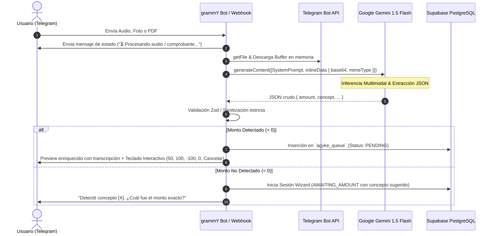

# Arquitectura Global de Ingestión Multimodal (Agyke System)

## 1. Motivación y Principio de Diseño
El registro manual de gastos por texto puede resultar tedioso en situaciones cotidianas (por ejemplo: salir del supermercado cargando bolsas, recibir un comprobante digital en PDF o pagar un almuerzo grupal).

Para maximizar la adopción y la velocidad de carga sin comprometer la integridad contable, Agyke implementa una **capa de ingestión multimodal** que procesa voz, imágenes y documentos PDF.

### Principio Fundamental: Modelo Canónico Unificado
> **Regla de Oro:** Ninguna lógica de negocio, cálculo de balance ni tabla de base de datos debe conocer el formato binario de entrada (audio, foto, PDF). Toda entrada multimodal se normaliza en una sola etapa hacia un **Contrato de Datos JSON Estructurado (`ExtractedExpenseDraft`)**.

```
[ Telegram Ingest ]
  ├─ Nota de Voz (OGG/Opus)   ──┐
  ├─ Foto Ticket (JPEG/PNG)   ──┼─► [ Gemini 1.5 Flash ] ─► [ ExtractedExpenseDraft JSON ] ─► [ Flujo Contable Agyke ]
  └─ Factura / Recibo (PDF)   ──┘
```

---

## 2. Contrato de Datos Unificado (`ExtractedExpenseDraft`)

Todo adaptador multimodal (voz, imagen, documento) debe producir exactamente una instancia tipada con la siguiente interfaz TypeScript estricta:

```typescript
export type ClassificationType = '50' | '100' | '-100' | '0';

export interface ExtractedExpenseDraft {
  /** Monto monetario detectado. Debe ser estrictamente positivo. 0 si no se detectó */
  amount: number;

  /** Concepto o descripción corta del gasto (ej: "Supermercado Coto", "Farmacia") */
  concept: string;

  /** Fecha de la transacción en formato ISO YYYY-MM-DD (si fue detectada en el ticket/factura) */
  date?: string | null;

  /** Clasificación de deuda detectada explícitamente en el audio o texto (50, 100, -100, 0) */
  suggested_classification?: ClassificationType | null;

  /** Nombre o alias de quien pagó si se mencionó explícitamente (ej: "pagó Lautaro") */
  payer_hint?: string | null;

  /** Nivel de certeza de la IA entre 0.0 y 1.0 */
  confidence: number;

  /** Transcripción del audio o resumen textual del comprobante para auditoría y preview */
  raw_transcription?: string | null;

  /** Tipo de fuente original */
  source_type: 'audio' | 'image' | 'document' | 'text';

  /** Metadatos extendidos para soporte contable avanzado */
  metadata?: {
    merchant?: string | null;       // Comercio o emisor (ej: "Carrefour", "Edenor")
    invoice_number?: string | null; // Número de factura o transacción
    currency?: string;              // "ARS", "USD" (por defecto "ARS")
    page_count?: number;            // Cantidad de páginas en PDFs
  };
}
```

---

## 3. Pipeline de Procesamiento de Extremo a Extremo

El flujo sigue estrictamente 6 fases secuenciales:



### Fases Detalladas:

1. **Recepción y Detección de MimeType:**
   - Detecta `ctx.message.voice` / `ctx.message.audio`, `ctx.message.photo` o `ctx.message.document`.
   - Se selecciona siempre la mayor resolución en fotos (`photo[photo.length - 1]`).
   - Se envía un mensaje inmediato de feedback ("⏳ Analizando comprobante...") para evitar la percepción de cuelgue.

2. **Descarga Segura en Memoria:**
   - Se obtiene `file_path` mediante `getFile` de la API de Telegram.
   - Se descarga como `Buffer` binario en memoria RAM. **Nunca se escribe en disco en entornos serverless**.
   - Se valida el tamaño máximo del archivo (ver límites de infraestructura).

3. **Inferencia Multimodal con Gemini 1.5 Flash:**
   - El `Buffer` se codifica a Base64 y se envía como `inlineData` con su `mimeType` oficial (`audio/ogg`, `image/jpeg`, `application/pdf`).
   - Se configura `generationConfig.responseMimeType = 'application/json'` para forzar respuesta estructurada determinística sin Markdown envolvente.

4. **Validación y Sanitización del JSON:**
   - Se parsea el JSON retornado.
   - Si `amount <= 0` o el JSON es inválido, se activa el fallback conversacional seguro (se pide el monto explícitamente sin fallar).

5. **Registro en Cola `agyke_queue`:**
   - Si el monto es válido, se inserta en `agyke_queue` con `status = 'PENDING'` y la transcripción/resumen para trazabilidad.

6. **Interacción con el Usuario:**
   - Se elimina el mensaje de "⏳ Procesando..." para mantener limpio el chat.
   - Se envía la tarjeta de confirmación con la transcripción ("🗣️ Entendí: ..."), monto, concepto y los 4 botones de acción rápida más el botón de cancelación.

---

## 4. Restricciones y Presupuesto de Infraestructura Serverless

Debido a que el webhook corre en **Vercel Serverless Functions**, rigen las siguientes restricciones técnicas innegociables:

| Parámetro | Límite Máximo Agyke | Justificación Técnica |
| :--- | :--- | :--- |
| **Tamaño Máximo de Audio** | 10 MB (~5 minutos de voz) | Vercel Function Payload & Timeout (15s en plan Hobby / 60s Pro). |
| **Tamaño Máximo de Imagen** | 8 MB | Suficiente para fotos de 48 MP tomadas con celular. |
| **Tamaño Máximo de PDF** | 10 MB (máx. 5 páginas analizadas) | Evita desbordamiento de memoria RAM (256MB/512MB) y procesamiento excesivo. |
| **Timeout de Inferencia Gemini** | 12.000 ms (12 segundos) | Se establece un `AbortSignal.timeout(12000)` para no agotar el tiempo de la función serverless. |
| **Almacenamiento Temporal** | 0 bytes en disco | `fileBuffer` estrictamente volátil en memoria. Se descarta al finalizar la petición. |

---

## 5. Manejo de Errores y Circuit Breakers

1. **Telegram File Download Timeout:**
   - Si Telegram tarda más de 5 segundos en entregar el archivo, se aborta y se notifica amigablemente al usuario: *"⚠️ Telegram tardó demasiado en transferir el archivo. Intenta reenviarlo o escribir el gasto manualmente."*

2. **Audio Inaudible o Demasiado Ruidoso:**
   - Si Gemini retorna `amount = 0` y `concept = "Inaudible"`, el bot no arroja excepción: solicita amablemente al usuario escribir el monto por texto.

3. **PDF Protegido por Contraseña o Corrupto:**
   - Si el documento PDF requiere contraseña o no tiene capas de texto ni imágenes legibles, se notifica: *"⚠️ El documento parece estar protegido con contraseña o no es un comprobante legible."*

4. **Botón Cancelar / Descartar Inmediato:**
   - Todo mensaje generado por una entrada multimodal incluye el comando `/cancelar` o un botón inline `[ ❌ Descartar ]` para que ningún intento fallido de la IA ensucie el historial financiero.
